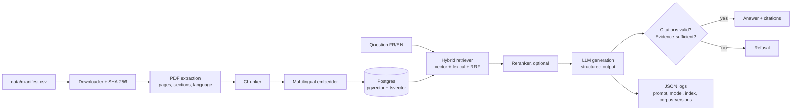

# regulens-rag

**Bilingual (FR/EN) question answering over Canadian financial regulation, with cited answers, controlled refusal, and eval-driven development.**

regulens-rag answers questions about public regulatory texts that apply to Canadian financial
institutions (OSFI/BSIF, AMF, FINTRAC/CANAFE, Québec Law 25). Every answer cites the document,
section and page it comes from. When the answer is not in the corpus, the system refuses instead
of guessing.

> Status: under construction. See [Project status](#project-status).

---

## Table of contents

1. [Why this project](#why-this-project)
2. [Project status](#project-status)
3. [Architecture](#architecture)
4. [Repository layout](#repository-layout)
5. [Prerequisites](#prerequisites)
6. [Quick start](#quick-start)
7. [How development works: Claude Code workflow](#how-development-works-claude-code-workflow)
8. [Owner tasks](#owner-tasks)
9. [Evaluation](#evaluation)
10. [Governance](#governance)
11. [Conventions](#conventions)
12. [Troubleshooting](#troubleshooting)
13. [Results](#results)
14. [Limitations](#limitations)
15. [Roadmap](#roadmap)

---

## Why this project

Compliance and risk teams in financial institutions spend hours searching long regulatory
guidelines, often in two languages. Generic chatbots answer confidently without sources, which
is unacceptable in a regulated environment.

This project shows how to build a retrieval-augmented generation (RAG) system that a regulated
institution could actually trust:

- **Traceable:** every answer links to a document, section, page and version.
- **Bilingual:** French and English questions, French and English sources, measured separately.
- **Honest:** out-of-scope questions are refused, and refusal accuracy is measured.
- **Evaluated:** a human-written test set gates every change.
- **Governed:** data provenance, versioned prompts, logged model and index versions, documented decisions.

It is the first of three portfolio projects: a RAG system (this repo), an AML alert-triage agent
that uses this system as a tool, and a production deployment with CI/CD, observability and a
governance file.

## Project status

| Milestone | Scope | Status |
|---|---|---|
| M0 | Scaffold: packaging, tooling, CI, database | started |
| M1 | Ingestion: download, hash, extract, detect sections and language | not started |
| M2 | Chunking, multilingual embeddings, hybrid retrieval | not started |
| M3 | Eval harness and retrieval benchmarks | not started |
| M4 | Generation with citations and refusal, LLM evals | not started |
| M5 | API, UI, model card, Docker | not started |

Detailed progress and open questions: [`docs/PROGRESS.md`](docs/PROGRESS.md).
Full plan with acceptance criteria: [`docs/PLAN.md`](docs/PLAN.md).

## Architecture



| Component | Default | Alternatives considered |
|---|---|---|
| Vector store | Postgres + pgvector | Qdrant, Chroma |
| Embeddings | `BAAI/bge-m3` (local, multilingual) | Hosted multilingual embedding APIs |
| Retrieval | Hybrid (vector + full-text, reciprocal rank fusion) | Vector only |
| LLM | Anthropic API, model set in config | Azure OpenAI, local models |
| API | FastAPI | Litestar |

Each choice is justified in an Architecture Decision Record under [`docs/adr/`](docs/adr/).

## Repository layout

```
regulens-rag/
├── CLAUDE.md                  # Instructions Claude Code reads every session
├── .claude/
│   ├── settings.json          # Permissions and hooks for Claude Code
│   └── skills/                # Slash commands: /milestone, /close-milestone, /eval, /adr
├── src/regulens/              # Application package (created in M0)
├── tests/                     # Unit tests, no network, no LLM
├── evals/
│   ├── golden_set.jsonl       # Human-written test questions (owner only)
│   ├── golden_set.example.jsonl
│   ├── thresholds.yaml        # Pass/fail targets (owner only)
│   └── results/               # Dated eval outputs
├── data/
│   ├── manifest.csv           # Source documents: URL, issuer, language, version, hash
│   └── raw/                   # Downloaded PDFs (git-ignored)
├── docs/
│   ├── PLAN.md                # Milestones and acceptance criteria
│   ├── PROGRESS.md            # Current state and open questions
│   ├── architecture.md
│   ├── model_card.md          # Created in M5
│   └── adr/                   # Architecture Decision Records
├── .env.example               # Configuration template, no secrets
└── README.md
```

## Prerequisites

| Tool | Why | Check |
|---|---|---|
| Git | Version control | `git --version` |
| Python 3.12 | Runtime | `python3 --version` |
| [uv](https://docs.astral.sh/uv/) | Dependency and environment management | `uv --version` |
| Docker + Docker Compose | Local Postgres with pgvector | `docker compose version` |
| Claude Code | AI pair programmer used to build the project | `claude --version` |
| Anthropic API key | Generation and LLM-as-judge evals (from M4) | set in `.env` |

Disk: plan for about 3 GB for the embedding model and the database.

## Quick start

> Commands below the M0 line only work once milestone M0 is complete.

```bash
git clone https://github.com/diomaye/regulens-rag.git
cd regulens-rag
cp .env.example .env          # then add your API key; never commit this file
```

After M0:

```bash
make setup                    # install dependencies, start Postgres
make test                     # unit tests
make lint                     # ruff + mypy
```

After M1 to M5, the full pipeline:

```bash
uv run regulens ingest        # download and extract sources from data/manifest.csv
uv run regulens index         # chunk, embed, build the index
uv run regulens search "Quelles sont les attentes du BSIF sur l'inventaire des modèles ?"
make eval-smoke               # 20-question eval
make run                      # API on http://localhost:8000
```

## How development works: Claude Code workflow

This project is built with [Claude Code](https://code.claude.com/docs/en/overview), guided by
committed instructions so that every session follows the same rules.

### The three layers

| File | Content | When it loads |
|---|---|---|
| `CLAUDE.md` | Project purpose, stack, code standards, governance rules | Every session |
| `.claude/skills/*/SKILL.md` | Procedures: how to start, close, evaluate, document | When you type the command |
| `docs/PLAN.md` | What each milestone must deliver | When a skill reads it |

Rule of thumb: change **what** gets built in `docs/PLAN.md`; change **how** Claude works in the
skill files; change **project-wide rules** in `CLAUDE.md`.

### Commands

| Command | What it does |
|---|---|
| `/milestone M0` | Reads the plan, proposes an implementation plan, waits for approval, builds and tests |
| `/close-milestone M0` | Checks the definition of done and the governance checklist, updates progress, commits |
| `/eval smoke` or `/eval full` | Runs evals, compares with the last run and thresholds, explains regressions |
| `/adr <title>` | Writes an Architecture Decision Record |

Run `/skills` inside Claude Code to confirm they are loaded.

### Standard loop for each milestone

1. Start a fresh session: `claude`, or `/clear` between milestones.
2. Run `/milestone Mx`.
3. **Review the plan carefully.** Correct it before approving; fixing a plan is cheaper than fixing code.
4. Let Claude implement. Read the diffs as they come.
5. Run `/close-milestone Mx`. Check the evidence it shows for each criterion.
6. Push, and confirm CI is green on GitHub.

### Permissions and guardrails

Configured in `.claude/settings.json`:

- **Allowed without asking:** `uv`, `make`, `docker compose`, read-only git, `git add`, `git commit`.
- **Asks first:** `git push`, `rm`, `uv remove`, `curl`.
- **Denied:** reading `.env` and `secrets/`, editing `evals/golden_set.jsonl` and `evals/thresholds.yaml`.
- **Hook:** after every file edit, `ruff format` and `ruff check --fix` run automatically.

These are guardrails, not a security perimeter: a shell command could still bypass a file rule.
The governance checklist in `/close-milestone` is the second line of defence.

Personal overrides go in `.claude/settings.local.json`, which is git-ignored.

## Owner tasks

Some work is deliberately kept human. The value of the project depends on it.

| When | Task | Why it is human |
|---|---|---|
| Before M1 | Fill `data/manifest.csv` with 30–60 official documents (current versions, both languages) | Source selection is a judgement call; provenance must be deliberate |
| During M3 | Write 80–120 questions in `evals/golden_set.jsonl` (25% French, 20% out of scope, 10% traps) | A test set written by the model only measures what the model already knows |
| During M4 | Label 30 answers by hand to calibrate the LLM judge | An uncalibrated judge is an unmeasured metric |
| Anytime | Set targets in `evals/thresholds.yaml` | Acceptance criteria belong to the owner, not the builder |

See `evals/golden_set.example.jsonl` for the question format.

## Evaluation

| Metric | Measured on | LLM needed |
|---|---|---|
| Retrieval recall@5, MRR | Answerable questions, split FR/EN | No |
| Refusal accuracy | Out-of-scope questions | Yes |
| Citation accuracy | Answerable questions | Yes |
| Faithfulness | Answers vs retrieved evidence (calibrated LLM judge) | Yes |
| Latency p95, cost per query | All questions | Yes |

- `make eval-smoke`: 20 questions, runs on every pull request.
- `make eval`: full set, run before each milestone closes.
- Results are written to `evals/results/<date>_<gitsha>.json` and never overwritten.

**Rule:** when a threshold is missed, fix the system. Never lower the threshold or edit the
test set to pass.

## Governance

| Control | Implementation |
|---|---|
| Data provenance | `data/manifest.csv` with source URL, issuer, version date and SHA-256 |
| Public data only | No client, employer or personal data, enforced by `CLAUDE.md` and the close checklist |
| Secrets | `.env` git-ignored and unreadable by Claude Code; GitHub secret scanning enabled |
| Traceability | Every answer logged with prompt version, model, index version and corpus hash |
| Change control | Eval gate in CI; thresholds owned by a human |
| Decisions | ADRs in `docs/adr/` with alternatives and failure signals |
| Transparency | `docs/model_card.md`: intended use, out-of-scope use, known limits |
| Privacy | No raw user input containing personal information in logs |

Out-of-scope use: this system does not provide legal or compliance advice. It helps locate and
summarize published guidance, with sources, for a human to verify.

## Conventions

- **Code:** full type hints, `mypy --strict`, dependencies behind interfaces so they can be faked in tests.
- **Tests:** unit tests never call the network or an LLM; tests that do are marked `@pytest.mark.llm`.
- **Commits:** conventional commits (`feat:`, `fix:`, `docs:`, `test:`, `chore:`).
- **Branches:** one branch per milestone (`m1-ingestion`), merged by pull request once CI is green.
- **Logging:** structured JSON; no `print` in committed code.
- **Language:** code, docs and commits in English; the corpus and test set are bilingual.

## Troubleshooting

| Symptom | Likely cause | Fix |
|---|---|---|
| `.gitignore` or `.claude/` not visible | Hidden dotfiles | `ls -la`; in Finder press `Cmd+Shift+.` |
| Skills missing from `/skills` | Session started outside the repo root | Restart `claude` from the repo root |
| Claude asks permission for every `make` command | Folder not trusted | Accept the trust prompt when starting `claude` |
| Commits show the wrong author | Local git identity | `git config user.email` and `git config user.name` |
| Database connection refused | Postgres not running | `docker compose up -d`, then `docker compose ps` |
| Evals cost too much | Full suite on every run | Use `make eval-smoke` during development |

## Results

To be filled from M3 onward. Each row is one improvement, measured on the same test set.

| Version | Change | Recall@5 (EN) | Recall@5 (FR) | Refusal acc. | Citation acc. | Faithfulness | p95 latency |
|---|---|---|---|---|---|---|---|
| baseline | | | | | | | |

## Limitations

To be completed as they are measured. Known in advance:

- Corpus limited to selected public documents; answers do not reflect unpublished guidance or recent amendments.
- Section detection depends on PDF quality; scanned documents are out of scope.
- Performance may differ between French and English; both are reported separately.

## Roadmap

- **Project 2:** AML alert-triage agent that calls this system as a tool, with human approval and red-teaming.
- **Project 3:** Production deployment with Terraform, CI/CD eval gate, observability, drift monitoring and a governance file mapped to NIST AI RMF, OSFI E-23 and Law 25.
