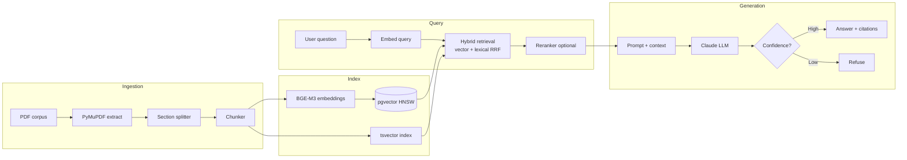

# Architecture

## Pipeline overview

## Components

| Component | Interface | Default implementation |
|---|---|---|
| PDF extraction | — | PyMuPDF |
| Embedder | `Embedder` | BGE-M3 via sentence-transformers |
| Retriever | `Retriever` | pgvector HNSW + tsvector, RRF fusion |
| Reranker | `Reranker` | BGE-reranker-v2-m3 (optional) |
| LLM | `LLMClient` | Anthropic API (model from config) |

## Data flow

1. **Ingestion**: PDFs listed in `data/manifest.csv` are downloaded, extracted, split into sections, then chunked.
2. **Indexing**: Chunks are embedded with BGE-M3 and stored in Postgres with pgvector (HNSW) and tsvector columns.
3. **Retrieval**: User query is embedded, then hybrid search (vector + lexical) with reciprocal rank fusion retrieves top-k chunks.
4. **Generation**: Retrieved chunks are passed as context to Claude, which produces a cited answer or refuses if evidence is insufficient.
